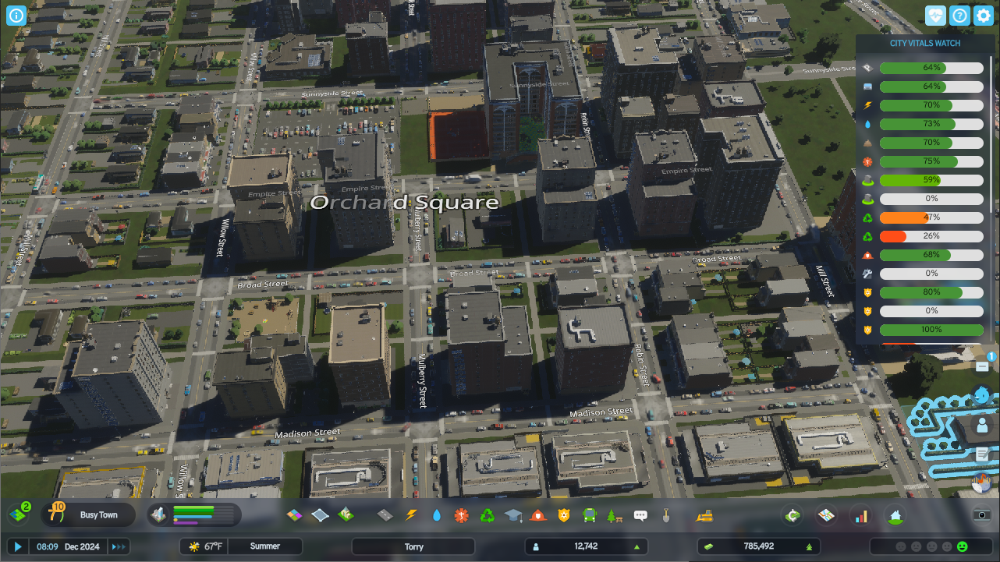
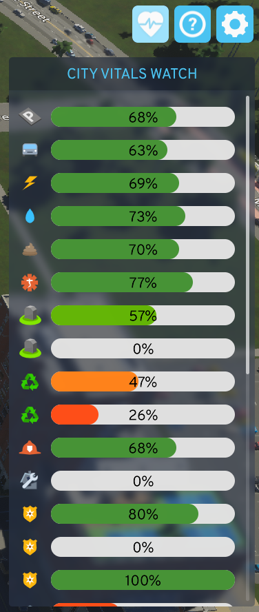

## Cities Skylines 2 - City Vitals Watch (Monitor Stats)

### Description

A panel to display vital city stats at a glance. Inspired by City Vitals Watch for CS1 ([Steam Workshop](https://steamcommunity.com/sharedfiles/filedetails/?id=410151616) | [Github](https://github.com/rob-williams/CityVitalsWatchMod/)).

### Features
- Persistent vitals panel (Toggleable)
- Scrollable list
- Most stats available

### Roadmap
Will organize a better roadmap on GitHub, but so far:
- Settings to show/hide certain stats [link](https://github.com/franzvezuli/cs2-city-vitals-watch/issues/4)
- Stat groupings (e.g. deathcare can use either) [link](https://github.com/franzvezuli/cs2-city-vitals-watch/issues/5)
- Draggable panel [link](https://github.com/franzvezuli/cs2-city-vitals-watch/issues/7)
- Mini view [link](https://github.com/franzvezuli/cs2-city-vitals-watch/issues/6)
- [And more...](https://github.com/franzvezuli/cs2-city-vitals-watch/issues)

### Screenshots

|                                Full Game                                |                                Closeup                                 |
|:-----------------------------------------------------------------------:|:----------------------------------------------------------------------:|
|   |  |

### Attributions

- Button Icon by [SVG Repo](https://www.svgrepo.com/svg/154308/pulse) licensed under the MIT License.

### Resources

- [PDX Wiki Community-made guides](https://cs2.paradoxwikis.com/Community-made_guides)
